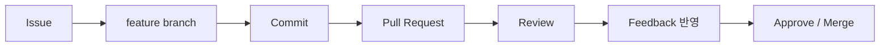
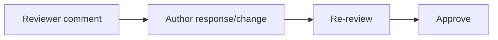

# B2-2 Round 01 — Beginner Guide

이 문서는 공식 Mission/Evaluation을 기준으로 **3~5인 팀이 GitHub Flow를 실제로 경험하고 증빙**하기 위한 가이드입니다.

> 현재는 **Phase A — REFERENCE BUILD**입니다. 실제 팀원·Issue·PR·Review·Merge·Conflict는 Phase C에서 생성합니다. Reference 템플릿의 `TODO_RUNTIME`을 실제 활동 없이 채우지 않습니다.

## 00. 미션 한눈에 보기

B2-2의 핵심은 복잡한 프로그램이 아니라 **협업 과정**입니다.



팀원 전원은 merged PR 2+, 타인 Review 2+, 본인 PR feedback 반영 1+가 필요합니다. 팀 전체는 충돌 2+ (비자명 1+), amend/reset/revert/stash 4종을 모두 수행해야 합니다.

---

# STEP 01 — 실제 3~5인 팀과 팀 저장소 준비

## ① 왜 하는가

이 미션은 혼자 만든 가짜 기록이 아니라 실제 협업 권한과 팀 활동을 평가합니다.

## ② 무엇을 하는가

3~5인 팀을 확정하고 Organization 저장소 또는 Collaborator 방식의 팀 저장소 1개를 준비합니다.

## ③ 이번 단계에서 알아야 할 용어

- **Collaborator** — 저장소에 협업 권한을 가진 사용자입니다.
- **Organization** — 여러 사람이 공동으로 GitHub 저장소를 관리하는 계정 단위입니다.
- **Branch Protection** — 특정 branch의 push/merge 방식을 제한하는 규칙입니다.

## ④ 필요한 핵심 개념

`main`을 아무나 직접 바꾸지 않고 PR과 승인 절차를 통과하게 해야 협업 기록과 품질 Gate가 남습니다.

## ⑤ 실행할 명령어 또는 코드

로컬 확인:

```bash
git --version
git config --get user.name
git config --get user.email
```

GitHub UI에서 실제 팀 저장소와 멤버 권한을 구성합니다. `main` Branch Protection에는 공식 최소조건을 적용합니다.

```text
- main 직접 push 금지
- PR을 통한 병합
- 최소 1명 approve
```

## ⑥ 명령어와 코드에 입문자가 이해할 수 있는 주석

Git 설정의 name/email은 commit 작성자를 기록합니다. Token/Password 자체는 출력하거나 Evidence에 남기지 않습니다.

## ⑦ 예상되는 정상 결과

3~5명 모두 팀 저장소에 접근 가능하고 main 보호 규칙이 확인됩니다.

## ⑧ 그 결과가 의미하는 것

이후 PR/Review 활동이 실제 팀 협업 기록으로 남을 기본 환경이 준비되었습니다.

## ⑨ 자주 발생하는 오류와 해결 방법

- 팀원이 push/PR 권한 없음 → Collaborator/Org 권한 재확인
- 보호 규칙 때문에 첫 설정 작업이 막힘 → 규칙을 우회하지 말고 feature branch + PR로 진행

## ⑩ 완료 확인

- [ ] 팀원 3~5명
- [ ] 팀 저장소 1개
- [ ] main Branch Protection
- [ ] PR + approve 1+

---

# STEP 02 — GitHub Flow와 협업 규칙 확정

## ① 왜 하는가

사람마다 branch/commit/review 방식이 다르면 기록은 남아도 협업이 일관되지 않습니다.

## ② 무엇을 하는가

Reference `docs/CONTRIBUTING.md`를 팀 기준으로 옮기고 branch naming, commit convention, PR/Review 규칙을 합의합니다.

## ③ 이번 단계에서 알아야 할 용어

- **GitHub Flow** — main + 짧은 feature branch + PR 중심의 협업 흐름입니다.
- **Commit Convention** — commit 메시지의 의미와 형식을 맞추는 규칙입니다.

## ④ 필요한 핵심 개념

```text
main = 통합 기준
feature/* = 한 작업 단위
```

작업 단위를 작게 나누면 Review와 충돌 해결이 쉬워집니다.

## ⑤ 실행할 명령어 또는 코드

Reference를 확인합니다.

```bash
sed -n '1,260p' training/round-01-clear/reference/team-repo/docs/CONTRIBUTING.md
```

팀 저장소에서는 예를 들어:

```bash
git switch main
git pull --ff-only
git switch -c feature/12-string-utils
```

## ⑥ 명령어와 코드에 입문자가 이해할 수 있는 주석

- `pull --ff-only`: 예상하지 못한 자동 merge commit을 피하면서 최신 main을 받습니다.
- `switch -c`: 새 feature branch를 만들고 이동합니다.

## ⑦ 예상되는 정상 결과

팀의 branch/commit/PR/review/conflict 규칙이 `CONTRIBUTING.md`에 고정됩니다.

## ⑧ 그 결과가 의미하는 것

이후 팀원이 같은 협업 계약을 사용하게 됩니다.

## ⑨ 자주 발생하는 오류와 해결 방법

`update`, `fix`, `wip`처럼 의미 없는 commit 메시지는 구체적인 변경 대상을 포함하도록 고칩니다.

## ⑩ 완료 확인

- [ ] branch naming
- [ ] commit convention
- [ ] PR What/Why/How
- [ ] Review 최소 품질
- [ ] conflict 대응 흐름

---

# STEP 03 — Issue → feature → PR 한 사이클 완주

## ① 왜 하는가

공식 미션은 모든 작업을 Issue와 PR로 추적할 수 있어야 합니다.

## ② 무엇을 하는가

작업 Issue 하나를 만들고 feature branch에서 작업한 뒤 `Closes #n`을 포함한 PR을 생성합니다.

## ③ 이번 단계에서 알아야 할 용어

- **Issue** — 해야 할 일/문제를 기록하는 GitHub 항목입니다.
- **Pull Request (PR)** — branch 변경을 main에 병합하기 전에 검토하는 요청입니다.
- **Traceability (추적성)** — 요구와 변경 기록을 서로 연결해 따라갈 수 있는 성질입니다.

## ④ 필요한 핵심 개념

`Issue = Why/Goal`, `PR = 실제 변경 + 검증`으로 연결합니다.

## ⑤ 실행할 명령어 또는 코드

```bash
git switch main
git pull --ff-only
git switch -c feature/<issue-number>-<topic>
# 파일 작업
git add <files>
git commit -m "feat: add <specific utility>"
git push -u origin HEAD
```

PR 본문:

```text
Closes #<issue-number>
What: ...
Why: ...
How: ...
```

## ⑥ 명령어와 코드에 입문자가 이해할 수 있는 주석

`-u origin HEAD`는 현재 feature branch를 원격에 올리고 이후 `git push` 기본 대상을 연결합니다.

## ⑦ 예상되는 정상 결과

Issue와 PR이 연결되고 diff/What/Why/How가 리뷰 가능한 상태로 보입니다.

## ⑧ 그 결과가 의미하는 것

팀원이 변경 이유부터 병합까지 한 흐름을 추적할 수 있습니다.

## ⑨ 자주 발생하는 오류와 해결 방법

- main에서 작업함 → 변경을 잃지 말고 새 feature branch로 옮긴 뒤 PR 흐름으로 복구
- `Closes #n` 누락 → PR 본문 수정

## ⑩ 완료 확인

- [ ] Issue
- [ ] feature branch
- [ ] 의미 있는 commit
- [ ] PR
- [ ] Closes/Fixes
- [ ] What/Why/How

---

# STEP 04 — 팀원별 최소 기여량 계획

## ① 왜 하는가

팀 전체 PR 수가 많아도 특정 팀원이 협업에 참여하지 않으면 공식 기준을 통과하지 못합니다.

## ② 무엇을 하는가

`SUBMISSION.md`를 기준으로 **개인별** 최소 요구를 사전에 배분합니다.

## ③ 이번 단계에서 알아야 할 용어

- **Contribution** — 팀 결과물에 남긴 실제 기여 기록입니다.
- **Submission Index** — 평가자가 팀원별 증거를 빠르게 찾는 인덱스입니다.

## ④ 필요한 핵심 개념

팀원마다 동일한 최소 Gate가 적용됩니다.

```text
PR 2+ / 타인 Review 2+ / 본인 PR 피드백 반영 1+ / 결과물 commit 1+
```

## ⑤ 실행할 명령어 또는 코드

Reference 인덱스 확인:

```bash
sed -n '1,240p' training/round-01-clear/reference/team-repo/SUBMISSION.md
```

실제 팀원 수에 맞춰 Member 섹션을 만듭니다.

## ⑥ 명령어와 코드에 입문자가 이해할 수 있는 주석

PR 링크만 모으지 말고 Issue, Review, feedback 반영, troubleshooting 참여까지 개인별로 연결합니다.

## ⑦ 예상되는 정상 결과

각 팀원의 남은 PR/Review/시나리오가 명확하게 보입니다.

## ⑧ 그 결과가 의미하는 것

마지막에 한 사람의 활동 부족 때문에 전체 팀 평가가 막히는 위험을 줄입니다.

## ⑨ 자주 발생하는 오류와 해결 방법

한 사람이 문서/코드를 독점하지 말고 작은 Issue를 분리해 전원이 실제 branch/PR을 경험하도록 배분합니다.

## ⑩ 완료 확인

- [ ] 전원 PR 2개 계획
- [ ] 전원 Review 2개 계획
- [ ] 전원 피드백 반영 계획
- [ ] 전원 결과물 기여 계획

---

# STEP 05 — 실질 Review와 피드백 반영

## ① 왜 하는가

평가는 `LGTM`만 남긴 Review를 실질 Review로 인정하지 않습니다.

## ② 무엇을 하는가

다른 팀원의 PR에서 특정 파일/라인을 근거로 질문·리스크·대안·테스트 제안을 남기고 작성자가 답변/수정합니다.

## ③ 이번 단계에서 알아야 할 용어

- **Code Review** — 병합 전에 다른 사람이 변경 내용을 검토하는 과정입니다.
- **Review Feedback** — 변경 개선을 위해 남긴 구체적 의견입니다.

## ④ 필요한 핵심 개념



## ⑤ 실행할 명령어 또는 코드

GitHub PR 화면에서 실제 line comment를 작성합니다. 예:

```text
이 함수에서 빈 문자열이 들어오면 현재 반환값이 의도한 동작인지 확인 부탁드립니다.
간단한 빈 입력 테스트를 추가하면 동작 의도가 더 명확할 것 같습니다.
```

작성자는 수정 후:

```bash
git add <file>
git commit -m "fix: handle empty input from review feedback"
git push
```

## ⑥ 명령어와 코드에 입문자가 이해할 수 있는 주석

새 push는 열린 PR에 자동 반영됩니다. 리뷰 코멘트를 지우는 대신 답글/수정으로 상호작용을 남깁니다.

## ⑦ 예상되는 정상 결과

실질 comment → 작성자 반영 → approval 흐름이 PR conversation에 남습니다.

## ⑧ 그 결과가 의미하는 것

PR이 단순 merge 버튼이 아니라 팀 품질 관리 장치로 동작합니다.

## ⑨ 자주 발생하는 오류와 해결 방법

리뷰 수량을 채우기 위한 의미 없는 코멘트를 만들지 말고 실제 diff를 근거로 작성합니다.

## ⑩ 완료 확인

- [ ] 팀원별 타인 Review 2+
- [ ] 실질 comment
- [ ] 본인 PR 피드백 반영 1+
- [ ] 상호작용 기록

---

# STEP 06 — 충돌 2회, 비자명 충돌 1회 재현

## ① 왜 하는가

충돌은 실패가 아니라 두 변경이 같은 영역에서 경쟁한다는 신호입니다. 팀은 의도를 비교해 안전하게 통합할 수 있어야 합니다.

## ② 무엇을 하는가

`conflict-resolution.md`의 두 시나리오를 실제 feature branch/PR에서 수행합니다.

## ③ 이번 단계에서 알아야 할 용어

- **Merge Conflict** — Git이 두 변경을 자동으로 합칠 수 없는 상태입니다.
- **hunk** — diff에서 서로 가까운 변경 라인 묶음입니다.
- **비자명 충돌 (Non-trivial Conflict)** — 단순 다른 파일이 아니라 같은 hunk 또는 rename/delete vs modify처럼 의사결정이 필요한 충돌입니다.

## ④ 필요한 핵심 개념

```text
충돌 마커 확인 → 양쪽 Issue 의도 확인 → 최종 내용 결정 → test → 기록
```

## ⑤ 실행할 명령어 또는 코드

충돌 발생 후 기본 확인:

```bash
git status
git diff
# 파일을 직접 해결
git add <resolved-file>
git status
# merge 상황에 맞게 commit
git push
```

## ⑥ 명령어와 코드에 입문자가 이해할 수 있는 주석

`<<<<<<<`, `=======`, `>>>>>>>`는 어느 쪽 변경인지 보여 주는 마커입니다. 마커만 삭제하고 한쪽을 무조건 버리면 안 됩니다.

## ⑦ 예상되는 정상 결과

최소 2개의 실제 conflict 기록과 해결 PR/commit이 남고, 그중 1개는 공식 비자명 기준을 만족합니다.

## ⑧ 그 결과가 의미하는 것

Git 충돌을 두려워해 회피하는 대신 요구사항과 변경 의도를 바탕으로 해결할 수 있습니다.

## ⑨ 자주 발생하는 오류와 해결 방법

conflict가 발생하지 않으면 두 branch가 실제 같은 hunk를 수정했는지, 한 branch가 먼저 main에 merge된 뒤 다른 branch가 최신 main을 가져왔는지 확인합니다.

## ⑩ 완료 확인

- [ ] conflict 2+
- [ ] non-trivial 1+
- [ ] 해결 과정 문서
- [ ] 해결 후 test

---

# STEP 07 — amend/reset/revert/stash 4종 실습

## ① 왜 하는가

Git 실수와 작업 전환 상황에서 history를 손상하지 않고 적절한 복구 도구를 선택해야 합니다.

## ② 무엇을 하는가

`troubleshooting-log.md`의 네 시나리오를 실제로 수행하고 Before/After를 기록합니다.

## ③ 이번 단계에서 알아야 할 용어

- **amend** — 최근 commit 수정
- **reset --soft** — 로컬 commit을 취소하면서 변경은 유지
- **revert** — 기존 commit의 반대 변경을 새 commit으로 추가
- **stash** — 미완성 변경 임시 보관

## ④ 필요한 핵심 개념

```text
아직 공유 전 → amend/reset 가능
이미 공유됨 → revert 우선
미완성 작업 임시 보관 → stash
```

## ⑤ 실행할 명령어 또는 코드

Reference 절차:

```bash
sed -n '1,320p' training/round-01-clear/reference/team-repo/docs/troubleshooting-log.md
```

각 시나리오를 **실습용 feature branch**에서 수행합니다.

## ⑥ 명령어와 코드에 입문자가 이해할 수 있는 주석

공유 main에서 reset/force push 실습을 하지 않습니다. `revert`는 shared history를 보존하는 핵심 차이를 직접 확인합니다.

## ⑦ 예상되는 정상 결과

4종 모두 Before/After 명령 출력과 관련 commit/PR 링크가 남습니다.

## ⑧ 그 결과가 의미하는 것

상황에 따라 Git 복구 명령을 구분해 사용할 수 있습니다.

## ⑨ 자주 발생하는 오류와 해결 방법

실습 중 history가 예상과 달라지면 force push부터 하지 말고 `git status`, `git log --oneline --graph --all`, `git reflog`로 현재 상태를 먼저 확인합니다.

## ⑩ 완료 확인

- [ ] amend
- [ ] reset --soft
- [ ] revert
- [ ] stash/pop
- [ ] 팀원별 최소 1개 기록 참여

---

# STEP 08 — 간단 결과물에 팀원별 실제 기여 남기기

## ① 왜 하는가

협업 워크플로우가 빈 문서 연습에 그치지 않고 각 팀원의 실제 commit/PR에 연결되어야 합니다.

## ② 무엇을 하는가

공식 선택지 중 하나를 선택합니다. Reference는 유틸 함수 모음을 권장하며 각 팀원이 함수 1개 이상을 자신의 Issue/feature/PR로 추가합니다.

## ③ 이번 단계에서 알아야 할 용어

- **Deliverable (결과물)** — 협업 과정 끝에 남는 실제 산출물입니다.

## ④ 필요한 핵심 개념

결과물 복잡성보다 **팀원별 기여 trace**가 중요합니다.

## ⑤ 실행할 명령어 또는 코드

예:

```text
Issue: "normalize_email 함수 추가"
Branch: feature/21-normalize-email
Commit: feat: add normalize email utility
PR: Closes #21
```

사용 예시는 README 또는 docstring에 남깁니다.

## ⑥ 명령어와 코드에 입문자가 이해할 수 있는 주석

각 팀원 함수가 반드시 대단할 필요는 없습니다. 미션 목적은 branch/PR/review 과정입니다.

## ⑦ 예상되는 정상 결과

팀원별 최소 1개의 결과물 기여 commit이 실제 Git history에 존재합니다.

## ⑧ 그 결과가 의미하는 것

협업 규칙을 실제 작은 개발 작업에 적용했습니다.

## ⑨ 자주 발생하는 오류와 해결 방법

한 PR에 전원 코드를 한 사람이 대신 넣지 말고 팀원별 Issue/branch/PR 기회를 보장합니다.

## ⑩ 완료 확인

- [ ] 결과물 유형 선택
- [ ] 팀원별 기여 1+
- [ ] 사용 예시

---

# STEP 09 — SUBMISSION과 Git Evidence 정리

## ① 왜 하는가

평가자가 여러 PR과 Review를 직접 찾아다니지 않도록 증거를 한 곳에 연결해야 합니다.

## ② 무엇을 하는가

`SUBMISSION.md`에 팀원별 Issue/PR/Review/feedback/troubleshooting 링크를 정리하고 git graph를 남깁니다.

## ③ 이번 단계에서 알아야 할 용어

- **Evidence Index** — 여러 증거의 위치를 한 문서에서 찾게 하는 목록입니다.
- **Git Graph** — branch/merge commit 관계를 시각적으로 보여 주는 로그입니다.

## ④ 필요한 핵심 개념

문서의 체크 표시보다 **클릭 가능한 실제 GitHub 기록**이 더 강한 Evidence입니다.

## ⑤ 실행할 명령어 또는 코드

```bash
git log --oneline --graph --all --decorate | tee git-history.txt
```

Reference SUBMISSION을 실제 팀 저장소에 맞춰 채웁니다.

## ⑥ 명령어와 코드에 입문자가 이해할 수 있는 주석

`--graph --all`은 main뿐 아니라 여러 branch의 commit 관계를 함께 보여 줍니다.

## ⑦ 예상되는 정상 결과

평가자가 `SUBMISSION.md`에서 각 팀원의 최소 요건과 핵심 문서를 바로 확인할 수 있습니다.

## ⑧ 그 결과가 의미하는 것

협업 과정이 재현·감사 가능한 형태로 정리되었습니다.

## ⑨ 자주 발생하는 오류와 해결 방법

`TODO_RUNTIME`이 남아 있으면 실제 링크가 없는 항목이므로 완료 처리하지 않습니다.

## ⑩ 완료 확인

- [ ] SUBMISSION 실제 링크
- [ ] 협업 문서 3종
- [ ] git graph
- [ ] conflict/troubleshooting links

---

# STEP 10 — Runtime Audit, Evaluation, CLEAR

## ① 왜 하는가

파일이 존재하는 것과 공식 팀 활동 수량/품질을 충족하는 것은 다릅니다.

## ② 무엇을 하는가

Checklist, local verify, GitHub UI/PR 기록, Evaluation Q&A를 교차 확인합니다.

## ③ 이번 단계에서 알아야 할 용어

- **Audit** — 기록과 요구사항을 근거로 누락을 체계적으로 점검하는 과정입니다.

## ④ 필요한 핵심 개념

```text
Requirement → GitHub Activity → Evidence Link → Evaluation → CLEAR
```

## ⑤ 실행할 명령어 또는 코드

Reference 구조 확인:

```bash
bash training/round-01-clear/environment/verify.sh
```

실제 팀 저장소 로컬 경로가 준비되면:

```bash
bash training/round-01-clear/environment/verify.sh --runtime /path/to/team-repo
```

GitHub의 Branch Protection/PR/Review 수량은 실제 UI/API 기록으로 별도 확인합니다.

## ⑥ 명령어와 코드에 입문자가 이해할 수 있는 주석

local script는 GitHub 서버의 모든 Review/Protection 정책을 대신 검증하지 않습니다. 실제 GitHub 기록 확인이 반드시 필요합니다.

## ⑦ 예상되는 정상 결과

문서 구조 누락이 없고 팀원별 PR/Review/feedback, conflict, troubleshooting, Branch Protection이 모두 실제 기록으로 확인됩니다.

## ⑧ 그 결과가 의미하는 것

Git 명령을 외운 것이 아니라 팀 협업 워크플로우를 실제로 수행하고 설명할 수 있는 상태입니다.

## ⑨ 자주 발생하는 오류와 해결 방법

수량이 부족하면 가짜 PR을 한꺼번에 만들지 말고 남은 작은 실제 작업을 Issue로 분리해 정상 협업 흐름으로 보충합니다.

## ⑩ 완료 확인

- [ ] 3~5인 실제 팀
- [ ] Branch Protection
- [ ] 전원 PR 2+
- [ ] 전원 타인 Review 2+
- [ ] 전원 feedback 반영 1+
- [ ] conflict 2+ / non-trivial 1+
- [ ] troubleshoot 4종 / 전원 참여 1+
- [ ] 결과물 전원 기여
- [ ] SUBMISSION/Evidence
- [ ] Evaluation 설명
- [ ] **✅ B2-2 CLEAR**
