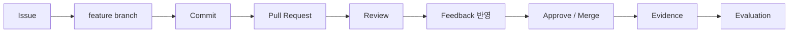

# B2-2 Round 01 — Beginner Guide

이 문서는 B2-2를 처음 수행하는 입문자가 **환경 → 실제 협업 → 검증 → 증빙 → 평가** 흐름을 잃지 않도록 안내하는 중앙 허브입니다.

> 문서 구조를 분할한 사실은 Runtime PASS, Evidence Complete, Mission CLEAR를 의미하지 않습니다. 실제 팀 활동과 실제 GitHub 기록은 별도로 검증합니다.

## 🚀 빠른 시작(Quick Start)

처음 시작한다면 다음 순서로 이동합니다.

```text
START-CHECK
→ 00 미션 개요
→ 01 환경·Git/GitHub Identity
→ 02 팀 저장소·GitHub Flow
→ 03 Issue·Branch·Commit·PR
→ 04 Review·Feedback
→ 05 Conflict
→ 06 Troubleshooting
→ 07 Deliverable·Evidence
→ 08 Verification·Evaluation
→ CHECKLIST
```

이미 공통 Ubuntu 24.04 환경이 준비되어 있다면:

1. [`START-CHECK.md`](START-CHECK.md)에서 Git/GitHub 기본 흐름을 확인합니다.
2. [`environment/README.md`](environment/README.md)에서 현재 실행 환경(Current Runtime Context)을 확인합니다.
3. MAC-V 5계정 Simulation은 [`environment/mac-v/README.md`](environment/mac-v/README.md)를 사용합니다.
4. 실제 팀 미션은 아래 모듈 지도에서 `02 → 08` 순서로 진행합니다.

## 📑 목차(Table of Contents)

- [빠른 시작(Quick Start)](#-빠른-시작quick-start)
- [학습 모듈 지도](#-학습-모듈-지도)
- [B2-2 핵심 흐름](#b2-2-핵심-흐름)
- [실제 미션과 Simulation 구분](#실제-미션과-simulation-구분)
- [핵심 문서](#-핵심-문서)
- [완료 판정](#완료-판정)

## 📚 학습 모듈 지도

| 모듈 | 주제 | 바로가기 |
|---:|---|---|
| 00 | 미션 개요·전체 흐름 | [00-overview](guide/00-overview/README.md) |
| 01 | Ubuntu 24.04·5계정·Git/GitHub Identity | [01-environment-identity](guide/01-environment-identity/README.md) |
| 02 | 실제 팀 저장소·Branch Protection·GitHub Flow | [02-team-repo-github-flow](guide/02-team-repo-github-flow/README.md) |
| 03 | Issue→feature→Commit→PR·개인별 기여 계획 | [03-issue-pr-contribution](guide/03-issue-pr-contribution/README.md) |
| 04 | 실질 Review·Feedback 반영 | [04-review-feedback](guide/04-review-feedback/README.md) |
| 05 | Conflict 2+·Non-trivial 1+ | [05-conflict](guide/05-conflict/README.md) |
| 06 | amend/reset/revert/stash | [06-troubleshooting](guide/06-troubleshooting/README.md) |
| 07 | 결과물·SUBMISSION·Evidence | [07-deliverable-evidence](guide/07-deliverable-evidence/README.md) |
| 08 | Runtime Audit·Evaluation·CLEAR | [08-verification-evaluation](guide/08-verification-evaluation/README.md) |

## B2-2 핵심 흐름



팀원 전원은 merged PR 2+, 타인 Review 2+, 본인 PR feedback 반영 1+가 필요합니다. 팀 전체는 충돌 2+ 중 비자명 충돌 1+와 amend/reset/revert/stash 4종 실제 수행 기록이 필요합니다.

## 실제 미션과 Simulation 구분

```text
실제 3~5인 팀 활동
→ 공식 B2-2 Runtime / Evidence 후보

5계정 학습 Simulation
→ 학습·반복·교차 플랫폼 훈련
→ 실제 팀 Evidence 대체 불가
```

5계정 설계는 [`environment/MULTI-ACCOUNT-SIMULATION.md`](environment/MULTI-ACCOUNT-SIMULATION.md)를 사용합니다.

## 🔗 핵심 문서

- [`CHECKLIST.md`](CHECKLIST.md) — 최종 요구사항 체크
- [`docs/requirements-mapping.md`](docs/requirements-mapping.md) — 요구사항→구현→검증→증빙
- [`docs/evaluation-qa.md`](docs/evaluation-qa.md) — 평가 질의응답
- [`docs/github-runtime-audit.md`](docs/github-runtime-audit.md) — GitHub 서버 기록 감사
- [`environment/README.md`](environment/README.md) — 실행환경 진입
- [`environment/MULTI-ACCOUNT-SIMULATION.md`](environment/MULTI-ACCOUNT-SIMULATION.md) — 5계정 Simulation
- [`docs/BEGINNER-GUIDE-MODULARIZATION-AUDIT.md`](docs/BEGINNER-GUIDE-MODULARIZATION-AUDIT.md) — 이번 분할 감사 기록

## 완료 판정

```text
Documentation Ready
≠ Runtime PASS
≠ Verification PASS
≠ Evidence Complete
≠ Mission CLEAR
```

상세 본문은 `guide/<module>/`에 유지하며 중앙 `BEGINNER-GUIDE.md`에는 Quick Start, 전체 지도, 다음 이동 경로를 중심으로 둡니다.
