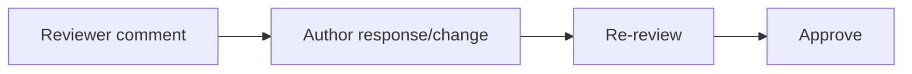

# STEP 05 — 실질 Review와 피드백 반영

## ① 왜 하는가

평가는 `LGTM`만 남긴 Review를 실질 Review로 인정하지 않습니다.

## ② 무엇을 하는가

다른 팀원의 PR에서 특정 파일/라인을 근거로 질문·리스크·대안·테스트 제안을 남기고 작성자가 답변/수정합니다.

## ③ 이번 단계에서 알아야 할 용어

- **Code Review** — 병합 전에 다른 사람이 변경 내용을 검토하는 과정입니다.
- **Review Feedback** — 변경 개선을 위해 남긴 구체적 의견입니다.

## ④ 필요한 핵심 개념



## ⑤ 실행할 명령어 또는 코드

GitHub PR 화면에서 실제 line comment를 작성합니다. 예:

```text
이 함수에서 빈 문자열이 들어오면 현재 반환값이 의도한 동작인지 확인 부탁드립니다.
간단한 빈 입력 테스트를 추가하면 동작 의도가 더 명확할 것 같습니다.
```

작성자는 수정 후:

```bash
git add <file>
git commit -m "fix: handle empty input from review feedback"
git push
```

## ⑥ 명령어와 코드에 입문자가 이해할 수 있는 주석

새 push는 열린 PR에 자동 반영됩니다. 리뷰 코멘트를 지우는 대신 답글/수정으로 상호작용을 남깁니다.

## ⑦ 예상되는 정상 결과

실질 comment → 작성자 반영 → approval 흐름이 PR conversation에 남습니다.

## ⑧ 그 결과가 의미하는 것

PR이 단순 merge 버튼이 아니라 팀 품질 관리 장치로 동작합니다.

## ⑨ 자주 발생하는 오류와 해결 방법

리뷰 수량을 채우기 위한 의미 없는 코멘트를 만들지 말고 실제 diff를 근거로 작성합니다.

## ⑩ 완료 확인

- [ ] 팀원별 타인 Review 2+
- [ ] 실질 comment
- [ ] 본인 PR 피드백 반영 1+
- [ ] 상호작용 기록

[이전: 모듈 README](README.md) · [다음: Conflict](../05-conflict/README.md)
